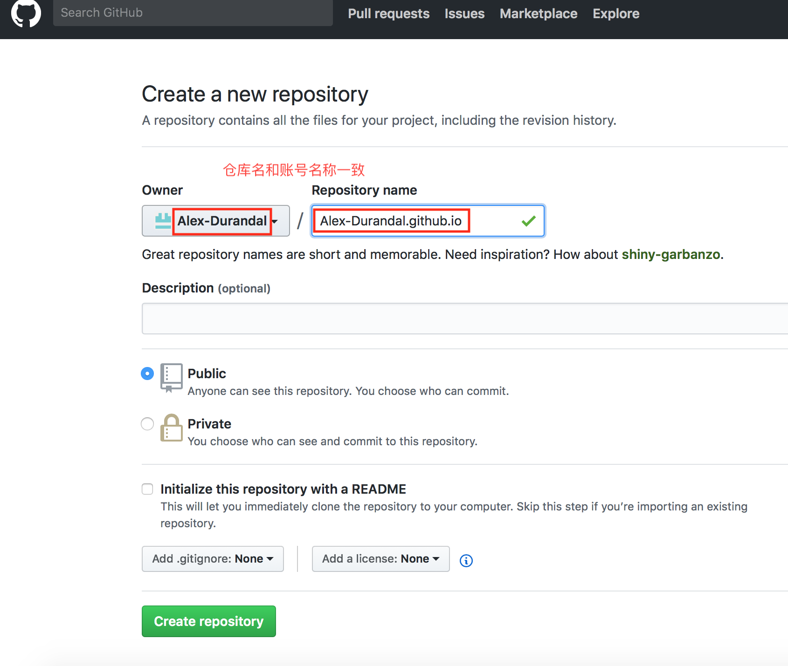
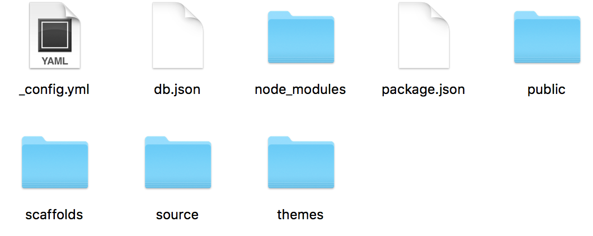
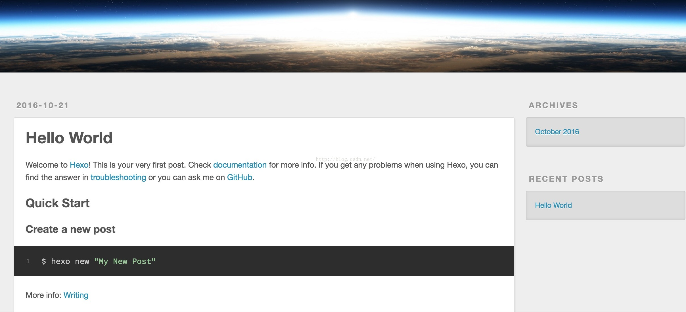

之前学习一直都没有记录的习惯，导致学到后面忘了前面，经常花费很多时间去做重复劳动。而且知识点没梳理，不能形成一个系统，学习不够深入和全面。所以决定开始自己写博客，记录自己的学习过程。
使用CSDN写博客感觉上传图片资源挺麻烦的，而且界面不是很美观，于是决定在github上搭建个人博客。一来迁移方便，二来免费，写作自由度高。下面介绍一下如何利用github搭建个人博客，主要分为以下几步：
1. github账号和仓库
2. 安装Node.js和hexo
3. 发布文章
4. 关联github账号 
5. 主题配置
6. hexo添加图片
---
## 一、github账号和仓库
注册github账号就不介绍了，在[官网](https://github.com)上注册即可。
然后创建博客仓库,仓库名称要与账号名称一致，仓库名为账username.github.io (其中username为你的账号名称)


## 二、安装Node.js和hexo
hexo是基于nodejs的，需安装nodejs
Mac安装nodejs可以选择homebrew
安装顺序：homebrew---->nodejs---->hexo
安装homebrew
`
ruby -e "$(curl -fsSL https://raw.githubusercontent.com/Homebrew/install/master/install)"
`
安装nodejs
`brew install node`
安装hexo
`sudo npm install -g hexo`

windows下可以上[官网](https://nodejs.org/en/download/)下载
## 三、发布文章
创建文件夹，此文件夹为博客的根目录
```
mkdir blog
cd blog
hexo init
```
此时blog文件下出现了很多文件和文件夹，如下图所示：


生成静态页面
```
hexo generate /** 生成一套静态网页 **/  
hexo server /** 在服务器上运行 **/ 
```
在浏览器上运行[http://localhost:4000](http://localhost:4000)就能看到如下的网站首页：

这里显示的是默认的主题和hello world.md页面内容，我们可以添加自己的文章

撰写博客
进入终端，使用cd命令进入到有Hexo框架的目录里面，输入：
`hexo new post "我的第一篇博客"`
随后出现如下的消息：
`INFO  Created: ~/blog/source/_posts/我的第一篇博客.md  `
证明创建文章成功，“我的第一篇博客”这个md文件会创建在source/_posts/的文件下。该md文件在自动生成时会带有一些属性：
title: 定义了博文的标题
date: 定义了创作博文的时间
tags: 定义了博文的标签
除了这个三个属性以外我们还可以扩展一些属性：
update:  定义了最后修改的时间
comments: 定义能否评论此博文(默认为true)
categories: 定义了博文的种类

## 四、关联github账号
执行到第三部分我们已经可以发布文章了，但是文章没有同步到github上，只能本地访问。我们需要将本地目录关联到github账号上。可以通过修改_config.yml配置文件实现，hexo的每一个功能的配置文件都是_config.yml，具体说明看下面的注解：

```
# Hexo Configuration  
## Docs: https://hexo.io/docs/configuration.html  
## Source: https://github.com/hexojs/hexo/  
  
# Site                 ##修改以适应搜索引擎的收录  
title: Hexo            ##定义网站的标题  
subtitle:              ##定义网站的副标题  
description:           ##定义网站的描述  
author: jason jwl      ##定义网站的负责人  
language:              ##定义网站的语言,默认zh-Hans  
timezone:              ##定义网站的时区  
  
# URL  
## If your site is put in a subdirectory, set url as 'http://yoursite.com/child' and root as '/child/'  
url: http://yoursite.com   ##定义网站访问的域名  
root: /      ##定义所在Web文件夹在哪个目录  
permalink: :year/:month/:day/:title/  ##定义时间格式  
permalink_defaults:  
  
# Directory  
source_dir: source   ##定义从哪个文件夹获取博客资料  
public_dir: public   ##定义生成静态网站到哪个文件夹  
  
archive_dir: archives  
category_dir: categories  
code_dir: downloads/code  
i18n_dir: :lang  
skip_render:  
  
# Writing  
new_post_name: :title.md # File name of new posts  
default_layout: post  
titlecase: false # Transform title into titlecase  
external_link: true # Open external links in new tab  
filename_case: 0  
render_drafts: false  
post_asset_folder: false  
relative_link: false  
future: true  
highlight:  
  enable: true  
  line_number: true  
  auto_detect: false  
  tab_replace:  
  
# Category & Tag  
default_category: uncategorized  
category_map:  
tag_map:  
  
# Date / Time format  
## Hexo uses Moment.js to parse and display date  
## You can customize the date format as defined in  
## http://momentjs.com/docs/#/displaying/format/  
date_format: YYYY-MM-DD  
time_format: HH:mm:ss  
  
# Pagination  
## Set per_page to 0 to disable pagination  
per_page: 10  ##定义每一页多少条博客  
pagination_dir: page  
  
# Extensions  
## Plugins: https://hexo.io/plugins/  
## Themes: https://hexo.io/themes/  
theme: landscape  ##定义使用的主题  
  
# Deployment  
## Docs: https://hexo.io/docs/deployment.html  
deploy:  
  type:  
```
注意：修改这些属性时，请注意格式，属性和值要空一个格，比如theme: landscape
关联github账号只需修改deploy配置即可，添加如下三行：
```
deploy:
  type: git
  repository: git@github.com:yourname/yourname.github.io.git
  branch: master
```
这样就关联好了github，回到命令行窗口，输入`npm install hexo-deployer-git --save`
接下来需要在hexo目录下做两件事:
`hexo g`(hexo generate的缩写)生成md文件的静态页面.md文件在hexo/source/_posts目录下。如果新写的md文件，复制到此即可. 生成的静态文件在public目录下，我们将其push到github就ok了。
`hexo d`(hexo depoly的缩写)将public文件夹东西推到仓库上，此时浏览器输入https://yourname.github.io就能看到自己博客啦!
还有个命令`hexo clean`作用是清除缓存db.json和public文件夹.

## 五、主题配置
默认的主题不太好看，我们可以使用其他主题。这里使用点赞最高的[next](http://theme-next.iissnan.com/getting-started.html#stable)主题。 
在博客根目录下执行:
```
git clone https://github.com/iissnan/hexo-theme-next themes/next
```
然后在博客根目录下的_config.yml下的theme的名称landscape修改为next即可。重新生成博客,就能看到next主题的效果了：
```
hexo clean
hexo g
hexo d
```
更换其他主题方法类似。

## 六、hexo添加图片
博客添加图片可以直接使用图床，在markdown中直接使用图片链接即可。但是用起来不太方便，每次都要先上传文件到图床中。那可不可以直接添加本地图片，然后发布文章时，图片和文章一起上传到github上呢？答案是当然可以啦！！

添加本地图片过程：
1. 把主页配置文件_config.yml 里的post_asset_folder:这个选项设置为true
2. 在你的hexo目录下执行这样一句话`npm install hexo-asset-image --save`，这是下载安装一个可以上传本地图片的插件
3. 再运行`hexo n "xxxx"`来生成md博文时，/source/_posts文件夹内除了xxxx.md文件还有一个同名的文件夹
4. 最后在xxxx.md中想引入图片时，先把图片复制到xxxx这个文件夹中，然后只需要在xxxx.md中按照markdown的格式引入图片：
`
`
注意： xxxx是这个md文件的名字，也是同名文件夹的名字。只需要有文件夹名字即可，不需要有什么绝对路径。你想引入的图片就只需要放入xxxx这个文件夹内就好了，很像引用相对路径。
5. 最后检查一下，hexo g生成页面后，进入public\2017\02\26\index.html文件中查看相关字段，可以发现，html标签内的语句是``，而不是``。这很重要，关乎你的网页是否可以真正加载你想插入的图片。

另一种方法
本地source中建立img文件夹
``

这个比较方便

## 参考文章
https://blog.csdn.net/yanzi1225627/article/details/54566792
https://blog.csdn.net/gdutxiaoxu/article/details/53576018
https://blog.csdn.net/sugar_rainbow/article/details/57415705